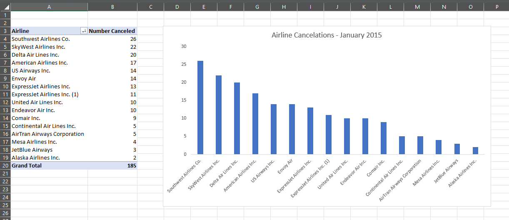

# ✈️ Flight Dataset

## Project Overview

This project demonstrates how I used SQL to clean and prepare a raw dataset for analysis

* MySQL 9.4.0
* Datasets used - Kaggle, [Flights](https://www.kaggle.com/datasets/mmetter/flights/data)

## Repository Content

* `raw_data/` - Original dataset (uncleaned)
* `cleaned_data/` - Final cleaned datasets
* `SQL/` - SQL scripts
* `images/` - images used in README.md
* README.md - Documentation of the process (this file)

The goal was to transform messy input data into a reliable dataset ready for reporting and anlysis

## Loading the raw data

`SQL/Load_Raw_Data.sql`

 1. Create a new database
 2. Create a raw tables
 3. Load the Flighs raw data
    * IGNORE 1 ROWS 1191805 row(s) affected Records: 1191805  Deleted: 0  Skipped: 0  Warnings: 0 14.140 sec

## Clean & Load Steps  

`SQL/Clean_Load_Data.sql` - turn Flights raw data in a relational DB

 Clean/Load `airports`

 1. Create table for airports
 2. Insert data into the airports table
    * Inserting rows based on a select that cleans the data
    * 365 row(s) affected Records: 365  Duplicates: 0  Warnings: 0 5.422 sec

 Clean/Load `airlines`

 1. Create table for airlines
 2. Insert data into the airlines table
    * Inserting rows based on a select that cleans the data
    * 26 row(s) affected Records: 26  Duplicates: 0  Warnings: 0 2.485 sec

 Clean/Load `flights`

 1. Create table for flights
 2. Insert data into the flights table
    * Inserting rows based on a select that cleans the data
    * 26 row(s) affected Records: 26  Duplicates: 0  Warnings: 0 2.485 sec

## Data Dictionary

`airlines`

|Column|Description|Data Type|Notes|
|----|----------|-----|----|
|airline_code|2 letter airline code IATA|CHAR(2)|Primary Key|
|airline_name|full airline name|VARCHAR(100)|-|

`airports`

|Column|Description|Data Type|Notes|
|----|----------|-----|----|
|airport_code|airport IATA code|CHAR(3)|Primary Key|
|airport_name|airport name|VARCHAR(100)|-|
|airport_city|city|VARCHAR(50)|-|
|airport_state|2 letter state code|CHAR(2)|-|

`Flights`

| Column | Description | Data Type | Notes |
|-------|----------|------|------|
|transacton_id|unique identifier for each fligh record|INT|Primary Key|
|flight_date|scheduled date of flight|DATE|-|
|airline_code|2-letter airline code (IATA)|CHAR(2)|foreign key to `airlines`|
|tail_num|aircraft registration number|VARCHAR(10)|identifies specific aircraft, may be masked|
|flight_num|airline-assigned flight number|INT|-|
|orgin_airport|origin airport IATA code|CHAR(3)|foreign key to `airports`|
|dest_airport|destination airport IATA code|CHAR(3)|foreign key to `airports`|
|sched_deptime|scheduled departure time|TIME|-|
|dep_time|actual departure time|TIME|-|
|dep_delay|departure delay in minutes|INT|-|
|taxi_out|taxi-out duration minutes|INT|-|
|wheels_off|time aircraft took off|TIME|-|
|wheels_on|time aircraft landed|TIME|-|
|taxi_in|taxi-in duration minutes|INT|-|
|sched_arr_time|scheduled arrival time|TIME|-|
|arr_time|actual arrival time|TIME|-|
|arr_delay|arrival delay in minutes|INT|positive=late, negative=early|
|sched_elapsed_time|scheduled total flight time minutes|INT|-|
|act_elapsed_time|acutal total flight time minutes|INT|-|
|cancelled|flight cancellation flag|BOOLEAN|-|
|diverted|flight diversion flag|BOOLEAN|-|
|distance|distance between origin and destination miles| INT|-|

## ER Diagram

## Analysis

### Questions that be asked and answered with this data

Airline Performance (2015)

| Airline Performance | SQL Script | Results |
|------|-----|----|
| Airlines with the most cancellations | SQL/Airline_Cancelations.sql | SQL/Airline_Cancelations_results.csv|
| Busiest airline by flight per month | SQL/Airline_Busiest.sql| SQL/Airline_Busiest_results.csv |
| Average departure delay per airline | SQL/Airline_AvgDepartureDelay | SQL/Airline_AvgDepatureDelay_results.csv |
| Average arrival deplay per airline | SQL/Airline_AvgArrivalDelay | SQL/Airline_AvgArrivalDelay_results.csv |

## Data Visualization

[My Tableau Profile](https://public.tableau.com/app/profile/t.robinson6379/vizzes)

